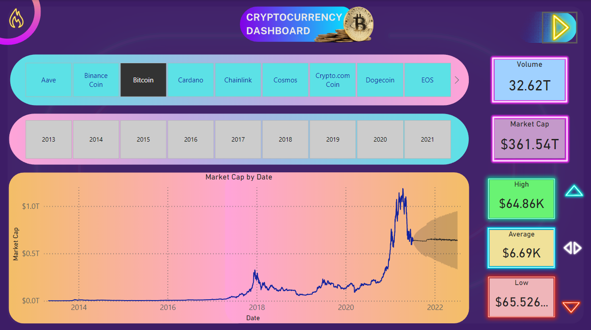

# 💲Cryptocurrency Dashboard📊

  Microsoft's Power BI software is one of the most popular and robust Business Intelligence solutions on the market. Power BI offers interactive data visualization and analysis for both cloud and on-prem environments. Power BI also offers data warehouse capabilities including data preparation, data discovery and interactive dashboards.
  
  One can mine data from any source and design BI Dashboards & Reports for organizations across all industries. The following example showcase Power BI's User Interface and functionality.
  
  I have developed one of the first Power BI dashboards utilizing the [Kaggle Dataset](https://www.kaggle.com/datasets/sudalairajkumar/cryptocurrencypricehistory) which contains high, low, open, and close prices for 23 cryptocurrencies including Bitcoin, Ethereum, Dogecoin, etc. Since the inception of these 23 cryptocurrencies, we can easily analyze patterns and anomalies.

  📍 Page 1 : 

   
  
  📍 Page 2 : 🔗
  
  
